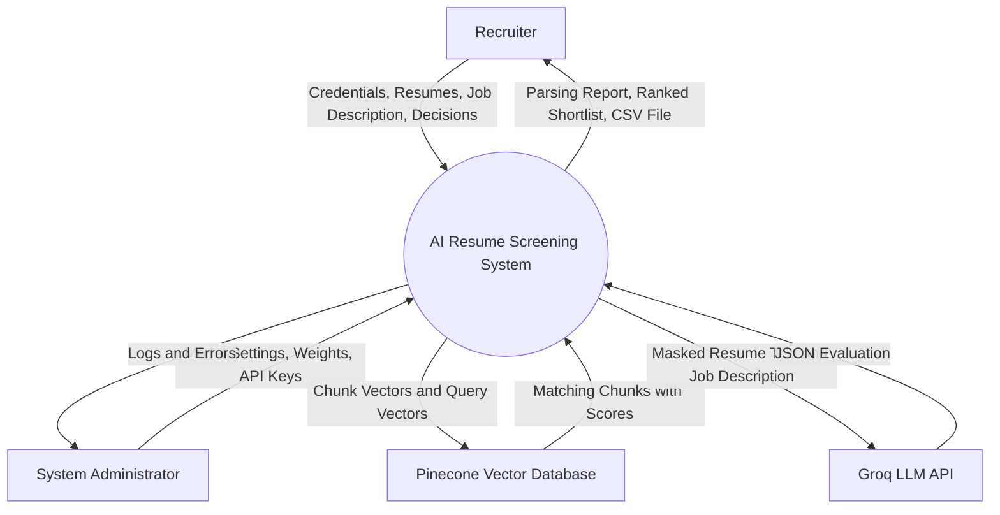
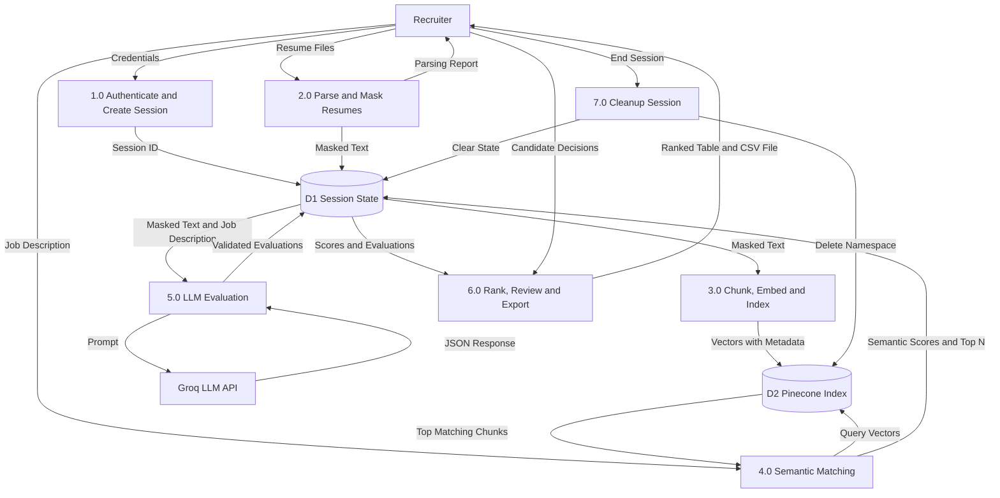
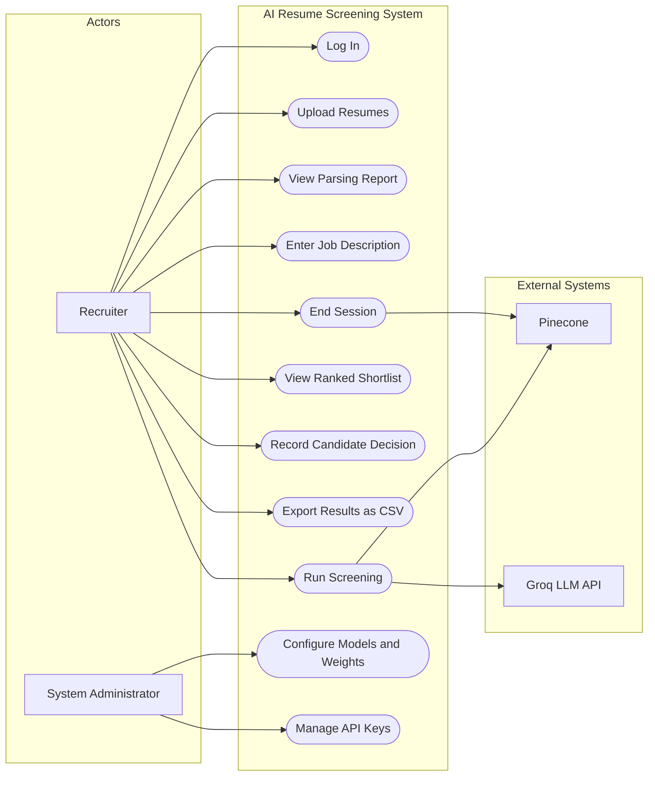
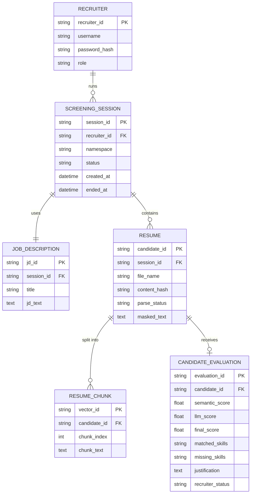
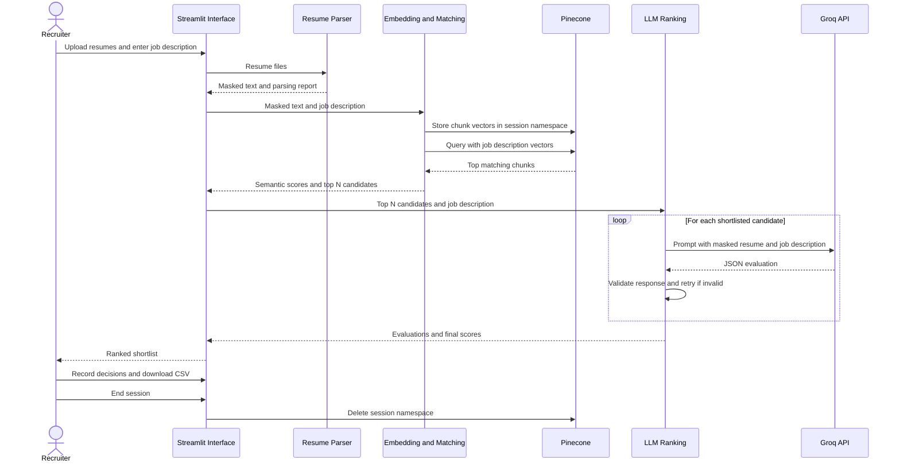

# Experiment 4: Software Requirement Specification

Study the structure and characteristics of a Software Requirements Specification and prepare the SRS document for the selected software project using the standard IEEE 830 / Karl E. Wiegers template.

**Course:** Software Design Principles (SDP)  
**Project Title:** AI-Based Resume Screening and Recruitment System  
**Class / Section:** IT-B (2026-27)  
**Prepared by:** Mukul Sharma (202401100600116)  
**Repository:** `https://github.com/IshwarRajChauhan/2026-27_IT-B_202401100600094`

### Team Members

| Name | Roll Number | Module |
|---|---|---|
| Ishwar Raj Chauhan (Team Leader) | 202401100600094 | Application Shell & Integration |
| Kartik Khandelwal | 202401100600099 | Embeddings & Vector Search |
| Ramit Gupta | 202401100600139 | Resume Ingestion & Parsing |
| Mukul Sharma | 202401100600116 | LLM Ranking & Justification |
| Nitin Kumar | 202401100600123 | Results UI, Export & Testing |

---


## Aim

To understand the significance and characteristics of a Software Requirements Specification and to prepare a complete SRS document for the AI-Based Resume Screening and Recruitment System.

## Objectives

- Understand what a Software Requirements Specification is and why it is used.
- Study the characteristics of a good SRS document.
- Convert the requirements gathered in Experiment 3 into a formal SRS.
- Specify external interfaces, system features and non-functional requirements.
- Prepare analysis models such as data flow diagrams, use case diagram and entity relationship diagram.

## Introduction

A Software Requirements Specification is a document that details the features, functionality and constraints of a software application. It clearly defines what the system must do, serves as a reference point throughout development, improves communication among team members and reduces the cost of later rework by identifying problems early.

A good SRS is correct, complete, consistent, unambiguous, ranked for importance, modifiable, verifiable, traceable, design independent, testable, understandable by the customer and written at the right level of abstraction.

---

# Software Requirements Specification

## for AI-Based Resume Screening and Recruitment System

Version 1.0 approved

Prepared by Mukul Sharma (202401100600116), on behalf of the project team

KIET Group of Institutions, Department of Information Technology

Date created: 2026-09-18

## Table of Contents

1. Introduction
   - 1.1 Purpose
   - 1.2 Document Conventions
   - 1.3 Intended Audience and Reading Suggestions
   - 1.4 Product Scope
   - 1.5 References
2. Overall Description
   - 2.1 Product Perspective
   - 2.2 Product Functions
   - 2.3 User Classes and Characteristics
   - 2.4 Operating Environment
   - 2.5 Design and Implementation Constraints
   - 2.6 User Documentation
   - 2.7 Assumptions and Dependencies
3. External Interface Requirements
   - 3.1 User Interfaces
   - 3.2 Hardware Interfaces
   - 3.3 Software Interfaces
   - 3.4 Communications Interfaces
4. System Features
   - 4.1 Recruiter Authentication and Session Management
   - 4.2 Bulk Resume Upload, Parsing and Data Masking
   - 4.3 Job Description Input and Semantic Matching
   - 4.4 LLM Based Scoring and Justification
   - 4.5 Ranked Shortlist, Recruiter Review and Export
   - 4.6 Session Cleanup and Configuration
5. Other Nonfunctional Requirements
   - 5.1 Performance Requirements
   - 5.2 Safety Requirements
   - 5.3 Security Requirements
   - 5.4 Software Quality Attributes
   - 5.5 Business Rules
6. Other Requirements

Appendix A: Glossary

Appendix B: Analysis Models

Appendix C: To Be Determined List

## Revision History

| Name | Date | Reason For Changes | Version |
|---|---|---|---|
| Mukul Sharma | 2026-09-18 | Initial SRS prepared from Experiment 2 and Experiment 3 | 1.0 |

---

## 1. Introduction

### 1.1 Purpose

This document specifies the software requirements for version 1.0 of the AI-Based Resume Screening and Recruitment System. It describes the complete scope of the application, including recruiter authentication, resume parsing, semantic matching, LLM based evaluation, shortlist review and export of results.

### 1.2 Document Conventions

Requirements are given a priority of High, Medium or Low. Each functional requirement is tagged as `REQ-<feature number>.<requirement number>`, for example `REQ-2.3`. Non-functional requirements are tagged as `NFR-<number>` and business rules as `BR-<number>`. The word "shall" indicates a mandatory requirement and "should" indicates a desirable requirement. The priority of a feature is inherited by its detailed requirements unless stated otherwise.

### 1.3 Intended Audience and Reading Suggestions

The document is intended for developers, testers, the project guide and recruitment stakeholders. Developers should read Sections 2, 3, 4 and Appendix B for design and integration details. Testers should read Sections 4 and 5 to derive test cases. The project guide and evaluators can read Sections 1 and 2 for an overview. Recruitment stakeholders can read Sections 1.4, 2.2 and 4 to confirm that the workflow matches actual screening practice.

### 1.4 Product Scope

The AI-Based Resume Screening and Recruitment System automates first-level resume screening. A recruiter uploads a batch of resumes and a job description. The system parses the resumes, masks personal information, generates embeddings with Hugging Face Sentence Transformers, stores them in the Pinecone vector database and matches them semantically against the job description. A Groq-hosted large language model evaluates the top candidates and returns a match score, matched skills, missing skills and a justification. The recruiter reviews the ranked shortlist, records decisions and exports the results as CSV.

The objectives of the product are to reduce the time spent on manual screening, to identify suitable candidates whose resumes use different wording from the job description, and to make every recommendation explainable while the final decision remains with a human recruiter. Optical character recognition, job portal integration, interview scheduling and automatic rejection of candidates are not included in version 1.0.

### 1.5 References

1. IEEE Std 830-1998, IEEE Recommended Practice for Software Requirements Specifications.
2. Karl E. Wiegers, Software Requirements Specification template.
3. Experiment 2: Problem Identification and Feasibility, AI-Based Resume Screening and Recruitment System.
4. Experiment 3: Requirement Gathering Report, AI-Based Resume Screening and Recruitment System.
5. Sentence Transformers documentation, https://www.sbert.net
6. Pinecone documentation, https://docs.pinecone.io
7. Groq API documentation, https://console.groq.com/docs
8. Streamlit documentation, https://docs.streamlit.io
9. Digital Personal Data Protection Act, 2023, Government of India.

---

## 2. Overall Description

### 2.1 Product Perspective

The system is a new, self-contained application and is not a replacement for an existing product. It is built as a Streamlit web application divided into four internal modules: Resume Parser, Embedding and Matching, LLM Ranking, and User Interface and Export. It depends on two external services, the Pinecone vector database and the Groq LLM API. Embeddings are generated locally using an open-source Sentence Transformers model.

```
                  +--------------------------------------+
                  |       Recruiter (Web Browser)        |
                  +------------------+-------------------+
                                     | HTTPS
                                     v
                  +--------------------------------------+
                  |          Streamlit Web App           |
                  |   (Login, Upload, JD, Results, CSV)  |
                  +------------------+-------------------+
                                     |
        +----------------------------+----------------------------+
        |                            |                            |
        v                            v                            v
+------------------+     +------------------------+     +--------------------+
|  Resume Parser   |     |  Embedding and Matching|     |    LLM Ranking     |
|  PyPDF, docx,    |---->|  Sentence Transformers |---->|  Groq API, JSON    |
|  data masking    |     |  chunking and scoring  |     |  validation        |
+------------------+     +-----------+------------+     +---------+----------+
                                     |                            |
                                     v                            v
                         +------------------------+     +--------------------+
                         |   Pinecone Vector DB   |     |  Ranked Shortlist  |
                         | namespace per session  |     |  and CSV Export    |
                         +------------------------+     +--------------------+
```

### 2.2 Product Functions

- Authenticate the recruiter and create an isolated screening session.
- Accept bulk resume uploads, extract text, mask personal information and report parsing status.
- Accept a job description, chunk and embed resumes, and store vectors in the vector database.
- Match resumes with the job description and compute a semantic similarity score for each candidate.
- Evaluate the top candidates using a large language model and obtain a score with justification.
- Display a ranked shortlist, record recruiter decisions and export results as CSV.
- Delete session data and allow administrators to configure models and settings.

### 2.3 User Classes and Characteristics

- **Recruiter or HR Executive:** The primary user class. Has basic computer skills and no machine learning background. Uses all screening features and needs a simple workflow with clear explanations.
- **Hiring Manager:** A secondary user who receives the exported shortlist. Requires relevance and visible skill gaps but does not log in to the system in version 1.0.
- **System Administrator:** A technical user responsible for deployment, API keys and configuration of models, top-N value and score weights.
- **Job Applicant:** An indirect stakeholder with no access to the system, whose resume is processed and whose personal data must be protected.

### 2.4 Operating Environment

The client runs in modern desktop web browsers such as Chrome, Firefox, Edge and Safari. The application runs on Python 3.13 managed with uv, using Streamlit on Windows, Linux or macOS, or on a cloud host such as Streamlit Community Cloud. Embeddings are produced by the `all-MiniLM-L6-v2` Sentence Transformers model on CPU. Vectors are stored in a Pinecone serverless index with cosine similarity, and LLM inference uses a Llama-family model on the Groq API.

### 2.5 Design and Implementation Constraints

- The embedding model truncates input beyond its token limit, therefore resumes and long job descriptions must be split into chunks before embedding.
- Version 1.0 supports only PDF files containing an extractable text layer and DOCX files; optical character recognition is not included.
- Free usage tiers of Pinecone and Groq impose request limits, therefore LLM evaluation is applied only to the top-N candidates.
- API keys shall be read from environment variables or the Streamlit secrets file and shall never be committed to version control.
- The system shall not take final hiring decisions; a human recruiter remains in control.
- Version 1.0 supports English language resumes and job descriptions.

### 2.6 User Documentation

- A README file containing setup, configuration and execution instructions.
- In-application help text for each step of the screening workflow.
- A short recruiter guide explaining scores, justifications and the limitations of AI evaluation.
- Developer notes describing module structure and configuration options.

### 2.7 Assumptions and Dependencies

- Recruiters have a stable internet connection.
- The Pinecone and Groq services are available and the project API keys remain valid.
- Uploaded resumes are mostly text-based and written in English.
- The job description supplied by the recruiter correctly reflects the role requirements.
- Free tier limits of the external services remain sufficient for project-scale usage.

---

## 3. External Interface Requirements

### 3.1 User Interfaces

- **Login screen:** username and password fields with a generic error message on failure.
- **Screening screen:** a multi-file uploader for PDF and DOCX resumes, a job description text area with optional file upload, and a Run Screening button with a progress indicator.
- **Parsing report:** a list of uploaded files with status values Parsed, Duplicate or Parse Failed.
- **Results screen:** a sortable table with rank, candidate identifier, final score, semantic score, LLM score, matched skills, missing skills, justification and recruiter status, together with a minimum score filter, a Download CSV button and an End Session button.
- Error messages are displayed in plain language and a help section is available on every screen.

### 3.2 Hardware Interfaces

No special hardware is required. The application runs on standard laptops and desktops. The host machine must have sufficient memory to load the embedding model, which is why a small model is selected.

### 3.3 Software Interfaces

- **Pinecone Python SDK:** creates or connects to the index, upserts chunk vectors with metadata, queries by vector within a namespace and deletes a namespace. Incoming data consists of matching chunk identifiers with similarity scores.
- **Groq Python SDK:** sends chat completion requests containing the job description and masked resume text and receives a JSON evaluation.
- **Sentence Transformers library:** encodes text chunks into normalised 384-dimensional embeddings.
- **PyPDF and python-docx:** extract raw text from PDF and DOCX resumes.
- **pandas:** builds the results table and generates the CSV export.
- Configuration values and API keys are read through python-dotenv or the Streamlit secrets mechanism.

### 3.4 Communications Interfaces

All communication between the browser and the hosted application shall use HTTPS. All requests to Pinecone and Groq shall use HTTPS through their official SDKs. Messages exchanged with the LLM use JSON format. No email, FTP or other communication protocols are required in version 1.0.

---

## 4. System Features

### 4.1 Recruiter Authentication and Session Management

#### 4.1.1 Description and Priority

Restricts access to authorised recruiters and creates an isolated session for each screening run. Priority: High (benefit 8, penalty 8, cost 3, risk 2).

#### 4.1.2 Stimulus/Response Sequences

- Recruiter submits login credentials. The system validates them and opens the screening screen, or displays a generic error message.
- Recruiter starts a new screening. The system generates a unique session identifier that is used as the vector database namespace.

#### 4.1.3 Functional Requirements

- **REQ-1.1:** The system shall require successful login before any screening feature is available.
- **REQ-1.2:** The system shall reject invalid credentials with a message that does not reveal which field was incorrect.
- **REQ-1.3:** The system shall generate a unique session identifier for every screening session.
- **REQ-1.4:** The system should terminate a session after 30 minutes of inactivity and require login again.

### 4.2 Bulk Resume Upload, Parsing and Data Masking

#### 4.2.1 Description and Priority

Accepts multiple resumes, extracts clean text, masks personal information and reports the status of each file. Priority: High (benefit 9, penalty 9, cost 5, risk 5).

#### 4.2.2 Stimulus/Response Sequences

- Recruiter uploads a set of resume files. The system validates each file, extracts and cleans the text, masks personal data and displays a parsing report.
- A file has no extractable text or is corrupt. The system marks it as Parse Failed and continues with the remaining files.

#### 4.2.3 Functional Requirements

- **REQ-2.1:** The system shall accept PDF and DOCX files of up to 5 MB each, with a maximum of 100 files per session.
- **REQ-2.2:** The system shall reject unsupported file types and display the reason.
- **REQ-2.3:** The system shall extract text using PyPDF for PDF files and python-docx for DOCX files.
- **REQ-2.4:** The system shall mark files with no extractable text as Parse Failed without stopping the batch.
- **REQ-2.5:** The system shall normalise extracted text by correcting whitespace, bullet characters and encoding issues.
- **REQ-2.6:** The system shall mask email addresses, phone numbers and profile links, and shall replace the candidate identity with a generated candidate identifier before storage or evaluation.
- **REQ-2.7:** The system shall detect duplicate uploads using a content hash and mark them as Duplicate.

### 4.3 Job Description Input and Semantic Matching

#### 4.3.1 Description and Priority

Embeds resume chunks and the job description, stores vectors in the vector database and computes a semantic similarity score for each candidate. Priority: High (benefit 9, penalty 9, cost 6, risk 5).

#### 4.3.2 Stimulus/Response Sequences

- Recruiter enters a job description and starts screening. The system chunks and embeds the resumes, stores the vectors in the session namespace, queries the database with the job description embedding and computes candidate scores.
- The job description is shorter than the minimum length. The system displays a warning before continuing.

#### 4.3.3 Functional Requirements

- **REQ-3.1:** The system shall accept a job description as pasted text or as an uploaded PDF, DOCX or TXT file.
- **REQ-3.2:** The system shall warn the recruiter if the job description contains fewer than 50 words.
- **REQ-3.3:** The system shall split each resume into chunks of approximately 150 words with an overlap of approximately 30 words.
- **REQ-3.4:** The system shall generate normalised embeddings using the configured Sentence Transformers model.
- **REQ-3.5:** The system shall store chunk vectors in the session namespace with metadata containing the candidate identifier and chunk index.
- **REQ-3.6:** The system shall split a job description that exceeds the model input limit into segments and combine the segment results.
- **REQ-3.7:** The system shall compute a semantic score for each candidate by aggregating the similarity of that candidate's best matching chunks.
- **REQ-3.8:** The system shall select the top-N candidates, with a default of 10 and a configurable range of 5 to 25, for LLM evaluation.

### 4.4 LLM Based Scoring and Justification

#### 4.4.1 Description and Priority

Uses a Groq-hosted large language model to evaluate the shortlisted candidates and return structured, explainable results. Priority: High (benefit 9, penalty 7, cost 5, risk 7).

#### 4.4.2 Stimulus/Response Sequences

- Semantic matching completes. The system sends each shortlisted candidate's masked resume text with the job description to the model, validates the response and stores the evaluation.
- The model returns invalid output or the API call fails. The system retries, and if it still fails the candidate is ranked using the semantic score only and marked as not evaluated by the model.

#### 4.4.3 Functional Requirements

- **REQ-4.1:** The system shall send only masked resume text and the job description to the language model.
- **REQ-4.2:** The system shall request a JSON response containing candidate identifier, match score from 0 to 100, matched skills, missing skills and a justification of at most 80 words.
- **REQ-4.3:** The system shall validate every response against this structure and shall retry up to two times when the response is invalid.
- **REQ-4.4:** The prompt shall instruct the model to use only evidence present in the resume and to ignore attributes such as gender, age, religion, caste and marital status.
- **REQ-4.5:** The system shall use a low temperature value between 0 and 0.2 for consistent scoring.
- **REQ-4.6:** The system shall handle rate limit errors using retries with exponential backoff.
- **REQ-4.7:** The system shall compute the final score as a weighted combination of the semantic score and the model score, using weights read from configuration.

### 4.5 Ranked Shortlist, Recruiter Review and Export

#### 4.5.1 Description and Priority

Presents results to the recruiter, records decisions and exports the shortlist. Priority: Medium (benefit 8, penalty 6, cost 3, risk 2).

#### 4.5.2 Stimulus/Response Sequences

- Evaluation completes. The system displays the ranked results table.
- Recruiter changes a candidate status or requests a download. The system updates the status or generates the CSV file.

#### 4.5.3 Functional Requirements

- **REQ-5.1:** The system shall display candidates in descending order of final score.
- **REQ-5.2:** The system shall allow filtering by a minimum final score.
- **REQ-5.3:** The system shall allow the recruiter to set each candidate status to Shortlisted, On Hold or Rejected.
- **REQ-5.4:** The system shall export a CSV file containing rank, candidate identifier, file name, all scores, matched skills, missing skills, justification and status.
- **REQ-5.5:** The system shall label all model output as a recommendation and shall not change a candidate status automatically.

### 4.6 Session Cleanup and Configuration

#### 4.6.1 Description and Priority

Controls data retention, configuration and logging. Priority: Medium (benefit 7, penalty 8, cost 2, risk 3).

#### 4.6.2 Stimulus/Response Sequences

- Recruiter ends the session. The system deletes the session namespace from the vector database and clears session data.
- Administrator updates the configuration. The system uses the new model name, top-N value and weights in the next session.

#### 4.6.3 Functional Requirements

- **REQ-6.1:** The system shall delete the session namespace from the vector database when a session ends.
- **REQ-6.2:** The system should delete namespaces of abandoned sessions within seven days.
- **REQ-6.3:** The system shall not permanently store uploaded resume files.
- **REQ-6.4:** The system shall read API keys only from environment variables or the secrets file.
- **REQ-6.5:** The system shall allow model names, top-N value and score weights to be changed through configuration without code changes.
- **REQ-6.6:** The system shall write processing logs without recording resume text or personal data.

---

## 5. Other Nonfunctional Requirements

### 5.1 Performance Requirements

- **NFR-1:** A batch of 50 text-based resumes of up to two pages each shall be parsed, embedded and indexed within two minutes on a standard CPU host, so that a recruiter can screen a batch without interrupting their workflow.
- **NFR-2:** Each similarity query should return within two seconds under normal network conditions.
- **NFR-3:** Evaluation of the top ten candidates by the language model should complete within 60 seconds when the API is operating normally.

### 5.2 Safety Requirements

- **NFR-4:** A corrupt or unreadable file shall never stop processing of the remaining files in the batch.
- **NFR-5:** If the language model service fails, the system shall fall back to semantic ranking and shall indicate clearly which candidates were not evaluated by the model.
- **NFR-6:** The system shall never reject a candidate automatically, because an incorrect automated rejection would cause loss of a genuine employment opportunity.
- **NFR-7:** The application shall display user-friendly error messages and shall not expose internal error traces to recruiters.

### 5.3 Security Requirements

- **NFR-8:** Access to screening features shall require authentication.
- **NFR-9:** API keys and credentials shall never be stored in source code or committed to version control.
- **NFR-10:** All communication with external services shall use HTTPS.
- **NFR-11:** Personal information shall be masked before any resume text is sent to an external service.
- **NFR-12:** Data belonging to one screening session shall not be accessible from another session.
- **NFR-13:** Handling of candidate data shall follow the principles of purpose limitation and data minimisation as described in the Digital Personal Data Protection Act, 2023.

### 5.4 Software Quality Attributes

- **Usability:** A recruiter shall be able to complete a screening in no more than five steps: log in, upload resumes, enter the job description, run screening and review or export results.
- **Explainability:** Every candidate evaluated by the model shall have matched skills, missing skills and a justification visible in the results table.
- **Fairness:** Scoring shall not use protected attributes. A counterfactual check shall be performed in which only non-job-relevant details of a resume are changed, and the final score should not change by more than five points.
- **Maintainability:** Parsing, matching, ranking and interface shall be implemented as separate modules, with unit test coverage of at least 70 percent for the parsing and matching modules.
- **Portability:** The application shall run on Windows, Linux and macOS using uv without code changes.
- **Reliability:** The screening workflow shall complete successfully for a batch in which some files fail to parse.

### 5.5 Business Rules

- **BR-1:** Final hiring decisions are always taken by a human recruiter; the system only produces recommendations.
- **BR-2:** Each screening session is linked to exactly one job description.
- **BR-3:** Only an authenticated recruiter may view candidate evaluations or export results.
- **BR-4:** Resumes marked as Parse Failed must be reviewed manually by the recruiter.
- **BR-5:** Only a system administrator may change model settings, score weights and API keys.

---

## 6. Other Requirements

**Database requirements:** Vectors are stored in a Pinecone index of dimension 384 using cosine similarity, with one namespace per screening session. Each record stores only the candidate identifier and chunk index as metadata. Session state and evaluations are held in application memory for the duration of the session, and exported CSV files are stored only on the recruiter's device.

**Legal requirements:** Candidate personal data shall be processed only for the stated screening purpose. The team notes that the use of artificial intelligence in recruitment is treated as high risk in some jurisdictions and that certain regions require bias audits of automated employment decision tools; such requirements must be reviewed before any commercial use.

**Reuse objectives:** The parsing and embedding modules are designed to be reusable for other document matching applications, such as matching project proposals or internship applications.

---

## Appendix A: Glossary

| Term | Definition |
|---|---|
| ATS | Applicant Tracking System, software used to manage job applications |
| Chunk | A small section of resume text that is embedded as a single vector |
| Cosine Similarity | A measure of similarity between two vectors based on the angle between them |
| CSV | Comma Separated Values, a plain text file format for tabular data |
| Embedding | A numerical vector that represents the meaning of a piece of text |
| Groq | A cloud platform that provides fast large language model inference through an API |
| JD | Job Description |
| JSON | JavaScript Object Notation, a structured data interchange format |
| LLM | Large Language Model |
| Namespace | A logical partition inside a Pinecone index used to isolate session data |
| Pinecone | A managed vector database used for similarity search |
| PII | Personally Identifiable Information |
| Sentence Transformers | A Python library used to generate text embeddings |
| SRS | Software Requirements Specification |
| Streamlit | A Python framework for building data web applications |
| Top-N | The number of highest scoring candidates selected for model evaluation |

---

## Appendix B: Analysis Models

### Model 1: Context Level Data Flow Diagram (Level 0)



### Model 2: Level 1 Data Flow Diagram



### Model 3: Use Case Diagram



### Model 4: Entity Relationship Diagram



### Model 5: Sequence Diagram for a Screening Run



---

## Appendix C: To Be Determined List

| Item | Reference Section | Description | Resolution |
|---|---|---|---|
| TBD-1 | Section 2.5 | Optical character recognition support for scanned resumes | Future enhancement |
| TBD-2 | REQ-4.7 | Final weights for combining the semantic score and the model score | After evaluation on a labelled resume set |
| TBD-3 | REQ-1.1 | Choice of authentication mechanism | Design phase |
| TBD-4 | REQ-6.2 | Confirmation of the retention period for abandoned sessions | Design review |
| TBD-5 | Section 1.4 | Integration with job portals or an Applicant Tracking System | Future enhancement |

---

## Observation

Preparing the SRS using the standard template converts the informal requirements collected in Experiment 3 into precise, numbered and testable statements. Tagging requirements and linking them to stimulus and response sequences makes the document verifiable and traceable, and the analysis models remove ambiguity about data flow, system boundaries and entity relationships. For an AI-based system, non-functional requirements such as fairness, explainability, privacy and fallback behaviour are as important as the functional features.

## Result

The Software Requirements Specification for the AI-Based Resume Screening and Recruitment System was successfully prepared using the IEEE 830 and Karl E. Wiegers template, covering the introduction, overall description, external interfaces, system features, non-functional requirements, other requirements and analysis models.
